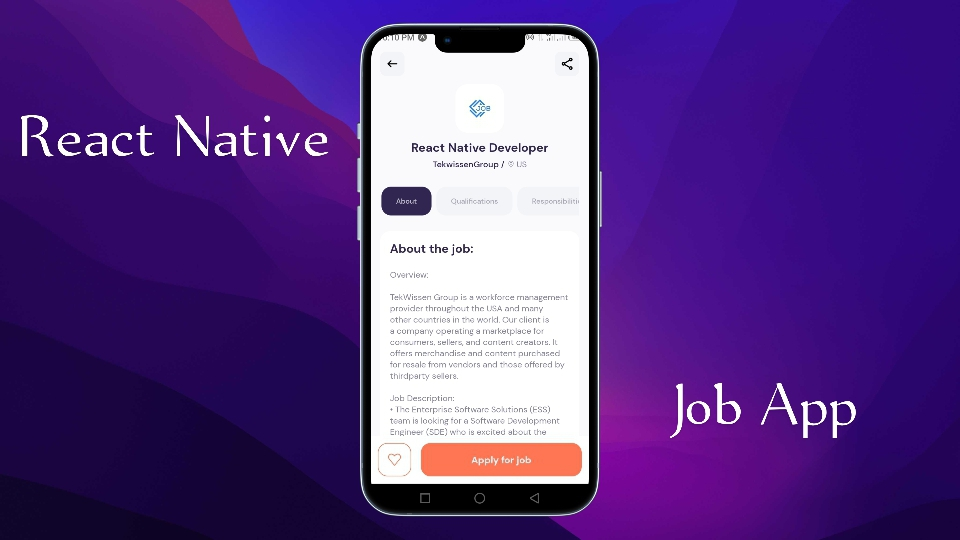

# Job Search Mobile App

<div style="max-width: 400px; aspec-ratio: 16:2; margin-bottom:0.5em;">
    
</div>

Small scale fullstack mobile app using expo, react-native, the new react-native router, and free job search API from RapidAPI hub.

## 🚀 How to setup

- Clone repository to your local machine.

```bash
git clone https://github.com/elvis-ndubuisi/jobs-app.git
```

- Install project packages. Before to have expo-cli and Nodejs > v14 <=v16

```bash
npm install
```

- Start project

```bash
npm start
```

- Scan the generated QR code (using Expo-Go app on your phone).

## How to setup 2

- Open [this expo build page](https://expo.dev/@elvis_ndubuisi/jobs-app?serviceType=classic&distribution=expo-go)
- Scan the QR-code using the Expo-Go app. (this only works for android users.)

## 🖌️ UI Design by

[Michel Achkar](https://dribbble.com/michelachkar)
